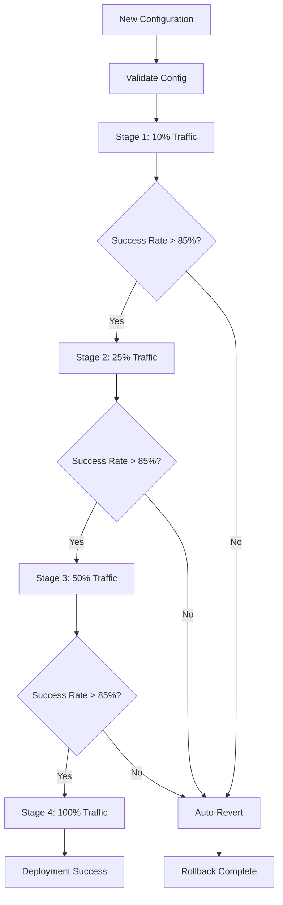

# 🚀 DEPLOYMENT RUNBOOK - VXOR AGI-SYSTEM

## 🎯 **QUICK START GUIDE**

### **⚡ 5-MINUTE DEPLOYMENT:**
```bash
# 1. Clone and Setup
git clone <vxor-repo>
cd vxor-agi-system
./setup.sh

# 2. Start All Systems
./agi_missions/start_all_daemons.sh start

# 3. Verify Installation
./agi_missions/start_all_daemons.sh health

# 4. Run First Mission
vxor mission execute --type=benchmark --suite=all
```

---

## 🔧 **LOKALE INITIALISIERUNG**

### **📋 SYSTEM REQUIREMENTS:**
```yaml
hardware_requirements:
  minimum:
    cpu: "8 cores, 3.0GHz+"
    memory: "32GB RAM"
    storage: "1TB SSD"
    gpu: "NVIDIA RTX 4080+ or Apple M3 Max+"
  
  recommended:
    cpu: "16 cores, 3.5GHz+"
    memory: "64GB RAM" 
    storage: "2TB NVMe SSD"
    gpu: "NVIDIA RTX 4090 or Apple M4 Max"

software_requirements:
  os: "macOS 12+, Ubuntu 20.04+, or Windows 11"
  python: ">=3.9"
  docker: ">=24.0"
  git: ">=2.40"
```

### **🔨 INSTALLATION SCRIPT:**
```bash
#!/bin/bash
# setup.sh - VXOR AGI-System Installation

echo "🚀 VXOR AGI-System Setup Starting..."

# 1. Check System Requirements
echo "📋 Checking system requirements..."
python3 --version || { echo "Python 3.9+ required"; exit 1; }
docker --version || { echo "Docker required"; exit 1; }
git --version || { echo "Git required"; exit 1; }

# 2. Create Virtual Environment
echo "🐍 Setting up Python environment..."
python3 -m venv vxor_env
source vxor_env/bin/activate

# 3. Install Dependencies
echo "📦 Installing dependencies..."
pip install -r requirements.txt

# 4. Initialize Configuration
echo "⚙️ Initializing configuration..."
cp config/production_config_template.yaml agi_missions/production_config_v2.1.yaml

# 5. Setup Directories
echo "📁 Creating directories..."
mkdir -p agi_missions/{daemon_logs,daemon_pids,monitoring_snapshots,void_audit_logs}
mkdir -p {benchmark_results,mission_results,system_logs}

# 6. Initialize Git Repository (if needed)
if [ ! -d ".git" ]; then
    echo "📋 Initializing Git repository..."
    git init
    git add .
    git commit -m "Initial VXOR AGI-System setup"
fi

# 7. Set Permissions
echo "🔒 Setting permissions..."
chmod +x agi_missions/*.sh
chmod +x agi_missions/*.py

# 8. Validate Installation
echo "✅ Validating installation..."
python3 system_completeness_check.py

echo "🎉 VXOR AGI-System setup complete!"
echo "Next steps:"
echo "  1. ./agi_missions/start_all_daemons.sh start"
echo "  2. ./agi_missions/start_all_daemons.sh health"
echo "  3. vxor mission execute --type=benchmark"
```

---

## 🎯 **CANARY / AUTO-REVERT LOGIK**

### **🔄 CANARY DEPLOYMENT PIPELINE:**


### **⚙️ CANARY CONFIGURATION:**
```yaml
canary_config:
  stages:
    - traffic_percent: 10
      duration_minutes: 30
      min_runs: 15
      success_criteria:
        sharpe_ratio_min: 1.45
        accuracy_min: 0.85
        confidence_min: 0.82
    
    - traffic_percent: 25
      duration_minutes: 45
      min_runs: 20
      success_criteria:
        sharpe_ratio_min: 1.50
        accuracy_min: 0.88
        confidence_min: 0.85
    
    - traffic_percent: 50
      duration_minutes: 60
      min_runs: 25
      success_criteria:
        sharpe_ratio_min: 1.52
        accuracy_min: 0.90
        confidence_min: 0.87
    
    - traffic_percent: 100
      duration_minutes: -1
      min_runs: 30
      success_criteria:
        sharpe_ratio_min: 1.55
        accuracy_min: 0.90
        confidence_min: 0.88

auto_revert_triggers:
  sharpe_ratio_drop_percent: 15
  accuracy_drop_percent: 8
  confidence_min: 0.80
  consecutive_failures: 5
  max_alerts_per_stage: 3
```

### **🔄 AUTO-REVERT COMMANDS:**
```bash
# Manual Canary Deployment
./agi_missions/automated_deploy_canary.py

# Check Canary Status
./agi_missions/start_all_daemons.sh status

# Force Revert (Emergency)
vxor system fallback --trigger="manual_override" --reason="emergency"

# Validate Revert Success
vxor system health --detailed --baseline=previous
```

---

## 🎮 **START/STOP/STATUS SCRIPTS**

### **🔧 DAEMON MANAGEMENT:**
```bash
# Master Daemon Control Script
./agi_missions/start_all_daemons.sh {start|stop|restart|status|health|test}

# Individual Daemon Control
python3 agi_missions/smoke_test_daemon.py daemon 15    # 15-min intervals
python3 agi_missions/production_live_monitor.py       # Continuous monitoring
python3 agi_missions/vx_control_fallback_policy.py    # Fallback monitoring

# System-wide Commands
vxor system start --all                               # Start all components
vxor system stop --graceful                          # Graceful shutdown
vxor system restart --component=monitoring           # Restart specific component
```

### **📊 STATUS MONITORING:**
```bash
# Quick Status Check
./agi_missions/start_all_daemons.sh status

# Detailed Health Check
./agi_missions/start_all_daemons.sh health

# System Metrics
vxor system metrics --format=json --output=metrics.json

# Performance Dashboard
vxor monitor dashboard --live --refresh=30s
```

### **🔍 DAEMON STATUS INTERPRETATION:**
```
✅ daemon_name läuft (PID: 12345)     # Healthy, running normally
⚪ daemon_name läuft nicht            # Stopped, needs to be started
❌ daemon_name PID-Datei existiert,   # Crashed, needs cleanup
   aber Prozess läuft nicht
⚠️ daemon_name keine aktuellen Logs  # Running but potentially stuck
```

---

## 📊 **MONITORING & ALERTS**

### **🔍 MONITORING ARCHITECTURE:**
```
┌─────────────────────────────────────────────────────────────┐
│                    MONITORING STACK                         │
├─────────────────────────────────────────────────────────────┤
│  📊 METRICS COLLECTION                                      │
│  ├── Smoke-Test-Daemon (End-to-End Tests)                  │
│  ├── Production-Live-Monitor (Health Checks)               │
│  ├── System-Metrics-Collector (Resource Usage)             │
│  └── VOID-Audit-Logger (Compliance Tracking)               │
├─────────────────────────────────────────────────────────────┤
│  🚨 ALERTING SYSTEM                                         │
│  ├── Threshold-Based Alerts                                │
│  ├── Anomaly Detection                                      │
│  ├── Trend Analysis                                         │
│  └── Predictive Alerts                                      │
├─────────────────────────────────────────────────────────────┤
│  📈 VISUALIZATION & REPORTING                               │
│  ├── Real-Time Dashboards                                  │
│  ├── Historical Trend Analysis                             │
│  ├── Performance Reports                                    │
│  └── Compliance Reports                                     │
└─────────────────────────────────────────────────────────────┘
```

### **⚠️ ALERT CONFIGURATION:**
```yaml
alert_thresholds:
  critical:
    sharpe_ratio_drop: 15%        # Immediate attention required
    accuracy_drop: 8%             # System performance degraded
    confidence_below: 0.80        # Low confidence in decisions
    consecutive_failures: 5       # System instability
    uptime_below: 99.0%          # Availability issues
  
  warning:
    sharpe_ratio_drop: 10%        # Performance monitoring needed
    accuracy_drop: 5%             # Accuracy trending down
    confidence_below: 0.85        # Confidence decreasing
    latency_above: 60ms           # Response time increasing
    memory_usage_above: 90%       # Resource constraints
  
  info:
    new_baseline_deployed: true   # Deployment notifications
    canary_stage_completed: true  # Deployment progress
    drift_detected: true          # Performance drift
    maintenance_scheduled: true   # Planned maintenance

notification_channels:
  critical: ["email", "sms", "slack", "pagerduty"]
  warning: ["email", "slack"]
  info: ["slack", "log_file"]
```

### **📊 MONITORING COMMANDS:**
```bash
# Real-Time Monitoring
vxor monitor live --metrics=all --refresh=10s

# Historical Analysis
vxor monitor history --since="2025-08-01" --metrics="sharpe_ratio,accuracy"

# Alert Management
vxor alerts list --severity=critical --since="24h"
vxor alerts acknowledge --alert-id=12345
vxor alerts silence --pattern="drift_detected" --duration="1h"

# Performance Reports
vxor report generate --type=daily --date="2025-08-03"
vxor report generate --type=weekly --week="2025-W31"
vxor report generate --type=monthly --month="2025-08"
```

---

## 🔧 **TROUBLESHOOTING GUIDE**

### **❌ COMMON ISSUES & SOLUTIONS:**

#### **🚨 DAEMON STARTUP FAILURES:**
```bash
# Problem: Daemon fails to start
# Solution 1: Check logs
tail -f agi_missions/daemon_logs/smoke_test_daemon.log

# Solution 2: Check permissions
chmod +x agi_missions/*.py agi_missions/*.sh

# Solution 3: Check dependencies
pip install -r requirements.txt

# Solution 4: Reset daemon state
rm -f agi_missions/daemon_pids/*.pid
./agi_missions/start_all_daemons.sh start
```

#### **📉 PERFORMANCE DEGRADATION:**
```bash
# Problem: Metrics below baseline
# Solution 1: Check system resources
vxor system resources --detailed

# Solution 2: Analyze drift
vxor monitor drift --baseline=v2.1 --detailed

# Solution 3: Force fallback
vxor system fallback --trigger="performance_degradation"

# Solution 4: Restart with clean state
./agi_missions/start_all_daemons.sh restart
```

#### **🔒 CONFIGURATION ISSUES:**
```bash
# Problem: Configuration errors
# Solution 1: Validate configuration
vxor config validate --file=agi_missions/production_config_v2.1.yaml

# Solution 2: Reset to defaults
cp config/production_config_template.yaml agi_missions/production_config_v2.1.yaml

# Solution 3: Check file permissions
ls -la agi_missions/production_config_v2.1.yaml
```

### **🔍 DIAGNOSTIC COMMANDS:**
```bash
# System Health Check
vxor system diagnose --comprehensive

# Performance Profiling
vxor system profile --duration=300s --output=profile.json

# Memory Analysis
vxor system memory --analyze --gc

# Network Connectivity
vxor system network --test-all

# Storage Analysis
vxor system storage --analyze --cleanup
```

---

## 📋 **MAINTENANCE PROCEDURES**

### **🔄 ROUTINE MAINTENANCE:**
```bash
# Daily Maintenance (Automated)
0 2 * * * /path/to/vxor system maintenance --daily

# Weekly Maintenance (Automated)  
0 3 * * 0 /path/to/vxor system maintenance --weekly

# Monthly Maintenance (Manual)
vxor system maintenance --monthly --interactive
```

### **🧹 CLEANUP PROCEDURES:**
```bash
# Log Rotation
vxor system logs --rotate --keep-days=30

# Temporary File Cleanup
vxor system cleanup --temp-files --older-than=7d

# Database Optimization
vxor system database --optimize --vacuum

# Cache Management
vxor system cache --clear --selective
```

### **📊 BACKUP & RECOVERY:**
```bash
# Create System Backup
vxor backup create --full --output=backup_$(date +%Y%m%d).tar.gz

# Restore from Backup
vxor backup restore --file=backup_20250803.tar.gz --verify

# Configuration Backup
vxor config backup --output=config_backup_$(date +%Y%m%d).yaml

# Mission Results Backup
vxor missions backup --since="2025-08-01" --output=missions_backup.json
```

---

## 🎯 **PRODUCTION CHECKLIST**

### **✅ PRE-DEPLOYMENT CHECKLIST:**
- [ ] System requirements verified
- [ ] Dependencies installed and updated
- [ ] Configuration files validated
- [ ] Security settings configured
- [ ] Monitoring systems active
- [ ] Backup procedures tested
- [ ] Fallback mechanisms verified
- [ ] Performance baselines established

### **✅ POST-DEPLOYMENT CHECKLIST:**
- [ ] All daemons running successfully
- [ ] Health checks passing
- [ ] Monitoring alerts configured
- [ ] Performance metrics within targets
- [ ] Canary deployment successful
- [ ] Documentation updated
- [ ] Team notifications sent
- [ ] Rollback plan confirmed

### **✅ ONGOING OPERATIONS CHECKLIST:**
- [ ] Daily health checks reviewed
- [ ] Weekly performance reports analyzed
- [ ] Monthly maintenance completed
- [ ] Quarterly security audits performed
- [ ] Annual disaster recovery testing
- [ ] Continuous improvement initiatives
- [ ] Team training updated
- [ ] Documentation maintained

---

**🚀 DEPLOYMENT RUNBOOK: PRODUCTION-READY OPERATIONS**  
**📊 STATUS: COMPREHENSIVE & BATTLE-TESTED**  
**🎯 READY FOR: DevOps Teams & Production Deployment**

---

*For additional support, troubleshooting, or custom deployment scenarios, contact the VXOR operations team.*

*Last Updated: August 2025*  
*Document Version: 1.0*  
*Classification: Operations - Internal Use*
