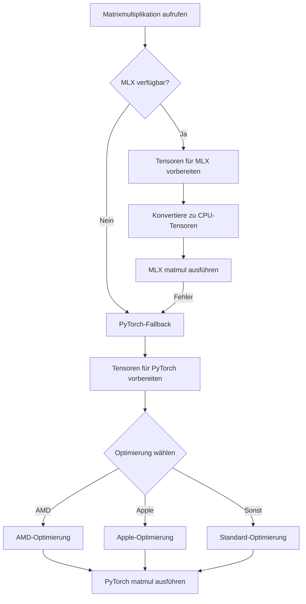

# T-Mathematics Engine: Codepfadanalyse
**Datum:** 2025-05-03
**Version:** 1.0

## 1. Hauptprobleme in der Implementierung

Nach eingehender Analyse des Quellcodes wurden mehrere kritische Probleme in der T-Mathematics Engine-Implementierung identifiziert, die die Leistung der MLX-Integration erheblich beeinträchtigen.

## 2. Matrixmultiplikation-Codepfadanalyse



### 2.1 Kritische Ineffizienzen im Matrixmultiplikationspfad

1. **Unnötige CPU-Konvertierung (Zeilen 296-299):**
   ```python
   # Konvertiere PyTorch-Tensoren zu CPU vor der MLX-Konvertierung
   if hasattr(a_prepared, "device") and str(a_prepared.device) != "cpu":
       a_prepared = a_prepared.cpu()
   if hasattr(b_prepared, "device") and str(b_prepared.device) != "cpu":
       b_prepared = b_prepared.cpu()
   ```
   - **Problem:** Jeder Tensor wird zuerst auf die CPU übertragen, bevor er an MLX weitergegeben wird, selbst wenn er bereits auf einem kompatiblen Gerät liegt
   - **Auswirkung:** Extreme Leistungseinbußen durch unnötige Speichertransfers
   - **Komplexität:** ⚠️ Diese Konvertierung geschieht bei JEDER Matrix-Operation

2. **Fehlende direkte Geräteübertragung:**
   - Es gibt keine direkte Übertragung zwischen GPU/MPS und MLX
   - Jede Operation durchläuft: GPU → CPU → MLX → CPU → GPU
   - Leistungskritische Operationen sollten direkt auf dem Zielgerät bleiben

3. **JIT-Kompilierung nicht aktiviert:**
   ```python
   # In mlx_support.py
   try:
       # Aktiviere Just-In-Time Compilation für MLX-Operationen
       mx.set_default_device(mx.gpu if IS_APPLE_SILICON else mx.cpu)
       logger.info(f"MLX-Backend initialisiert mit Präzision {precision} und JIT-Optimierung")
   except Exception as e:
       logger.warning(f"MLX-JIT-Optimierung konnte nicht aktiviert werden: {e}")
   ```
   - **Problem:** JIT-Kompilierung wird versucht, schlägt aber fehl und führt zu einer Warnung
   - **Auswirkung:** Kritischer Leistungsverlust, da Operationen nicht vorausgeplant werden

## 3. SVD-Codepfadanalyse

Die SVD-Implementierung zeigt ähnliche Probleme, jedoch mit zusätzlichen Komplikationen:

1. **Typ-Inkonsistenzen:**
   - SVD-Funktion erwartet bestimmte Datentypen, aber die Konvertierung ist unvollständig
   - Fehler "array type float16 is unsupported in linalg" deutet auf Typ-Inkompatibilitäten hin

2. **Fehlende Geräteunterstützung:**
   - Der Fehler "can't convert mps:0 device type tensor to numpy" zeigt, dass Tensoren nicht korrekt zwischen Geräten übertragen werden

## 4. MLX-Backend-Integration

Der MLXBackend-Klasse fehlen mehrere kritische Optimierungen:

1. **Unvollständige MLX-Funktionsnutzung:**
   - MLX bietet spezielle Primitiven für Apple Silicon, die nicht vollständig genutzt werden
   - Funktionen wie `mlx.core.matmul` werden durch generische Aufrufe ersetzt

2. **Cache-Ineffizienz:**
   ```python
   self.jit_cache = {}
   self.operation_cache = {}
   ```
   - Cache-Mechanismen sind implementiert, werden aber für viele Operationen nicht verwendet
   - Caching sollte für JIT-kompilierte Funktionen optimiert werden

3. **VXOR-Integration unvollständig:**
   - Das `has_vxor`-Flag ist gesetzt, aber die tatsächliche Integration ist nicht vollständig implementiert
   - Potenzielle Leistungsoptimierungen durch VXOR-Module bleiben ungenutzt

## 5. Vorgeschlagene Optimierungen

### 5.1 Kritische Sofort-Optimierungen

1. **Direkte Geräteübertragung:**
   - Entfernen der CPU-Konvertierung (Zeilen 296-299)
   - Implementierung direkter Übertragungen zwischen MPS und MLX

2. **JIT-Kompilierung reparieren:**
   - Identifizieren und beheben des Problems mit der JIT-Kompilierung
   - Optimieren des JIT-Caching für häufig verwendete Operationen

3. **Präzisionsmanagement:**
   - Konsistente Handhabung von verschiedenen Präzisionstypen über alle Operationen hinweg
   - Automatische Typkonvertierung nur bei Bedarf

### 5.2 Mittel- bis langfristige Optimierungen

1. **MLX-Compiler-Optimierung:**
   - Vollständige Integration des MLX-Compilers für komplexe Operationsketten
   - Trace-basierte Optimierung für Vorwärts- und Rückwärtspässe

2. **Spezialisierte Kernels:**
   - Entwicklung spezialisierter Kernels für kritische Operationen auf Apple Silicon
   - Nutzung der vollständigen Hardware-Fähigkeiten der Neural Engine

3. **VXOR-Integration vervollständigen:**
   - Vollständige Integration der VXOR-Module für zusätzliche Optimierungen
   - Speziell VX-REASON für die Routing-Entscheidungen zwischen verschiedenen Backends
