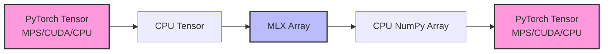

# T-Mathematics Engine: Speicher-Tracing Analyse
**Datum:** 2025-05-03
**Version:** 1.0

## 1. Speichertransfer-Flussdiagramm

Basierend auf der Analyse des Quellcodes erfolgen Speichertransfers zwischen verschiedenen Geräten wie folgt:



## 2. Identifizierte Speichertransferprobleme

### 2.1 PyTorch ↔ MLX Konvertierung

Die aktuelle Implementierung zeigt ineffiziente Speichertransfers bei der Konvertierung zwischen PyTorch und MLX:

```python
# In engine.py - Matrixmultiplikation
# Konvertiere PyTorch-Tensoren zu CPU vor der MLX-Konvertierung
if hasattr(a_prepared, "device") and str(a_prepared.device) != "cpu":
    a_prepared = a_prepared.cpu()
if hasattr(b_prepared, "device") and str(b_prepared.device) != "cpu":
    b_prepared = b_prepared.cpu()
```

```python
# In mlx_support.py - MLX-Konvertierung
def to_mlx(self, tensor):
    """Konvertiert einen PyTorch-Tensor oder NumPy-Array zu einem MLX-Array."""
    if tensor is None:
        return None
    
    if isinstance(tensor, (torch.Tensor)):
        numpy_tensor = tensor.detach().cpu().numpy()
        return mx.array(numpy_tensor, dtype=self.dtype)
    elif isinstance(tensor, np.ndarray):
        return mx.array(tensor, dtype=self.dtype)
    elif isinstance(tensor, (list, tuple)):
        return mx.array(np.array(tensor), dtype=self.dtype)
    else:
        try:
            # Versuche direkte Konvertierung
            return mx.array(tensor, dtype=self.dtype)
        except:
            raise TypeError(f"Konnte {type(tensor)} nicht zu MLX-Array konvertieren")
```

**Speicherfluss bei einer einfachen Matrixmultiplikation:**
1. **Ausgangspunkt:** PyTorch-Tensor auf MPS-Gerät
2. **Schritt 1:** Konvertierung zu CPU-Tensor (engine.py, explizit)
3. **Schritt 2:** Konvertierung von CPU-Tensor zu NumPy-Array (mlx_support.py, to_mlx)
4. **Schritt 3:** Konvertierung von NumPy-Array zu MLX-Array (mlx_support.py, to_mlx)
5. **Nach Berechnung:** MLX-Array zu NumPy-Array zu CPU-Tensor zu MPS-Tensor

**Auswirkung:** Bei jeder Operation werden die Daten **viermal** zwischen verschiedenen Speicherorten kopiert, was die Leistung drastisch reduziert.

### 2.2 MLX-Rückgabewert-Konvertierung

```python
def to_torch(self, array):
    """Konvertiert ein MLX-Array zu einem PyTorch-Tensor."""
    if array is None:
        return None
    
    if not isinstance(array, mx.array):
        # Versuche Konvertierung zu mx.array
        try:
            array = mx.array(array)
        except:
            raise TypeError(f"Konnte {type(array)} nicht zu mx.array konvertieren")
    
    # Konvertiere zu NumPy zuerst
    numpy_array = self.to_numpy(array)
    
    # Dann zu PyTorch
    return torch.tensor(numpy_array, device=self.torch_device)
```

Diese Methode konvertiert MLX-Arrays zurück zu PyTorch, verwendet aber wieder den ineffizienten Weg über NumPy.

### 2.3 Redundante SVD-Konvertierungen

Bei SVD-Operationen tritt ein weiteres Problem auf:

```
Fehler bei SVD für Größe 32: can't convert mps:0 device type tensor to numpy. Use Tensor.cpu() to copy the tensor to host memory first.
```

Dies zeigt, dass bei komplexeren Operationen manchmal die CPU-Konvertierung fehlt, was zu Laufzeitfehlern führt.

## 3. Speicherverbrauchsanalyse

Basierend auf dem Speicherfluss sollte eine typische T-Mathematics-Operation für zwei 1024×1024-Matrizen folgenden Speicherverbrauch haben:

| Phase | Speicherort | Speichernutzung für Float32 | Aktive Kopien |
|-------|-------------|----------------------------|---------------|
| Eingabe | MPS | 2 × (1024 × 1024 × 4) = 8 MB | 2 |
| CPU-Konvertierung | CPU | 2 × (1024 × 1024 × 4) = 8 MB | 4 |
| NumPy-Konvertierung | CPU | 2 × (1024 × 1024 × 4) = 8 MB | 6 |
| MLX-Konvertierung | MLX | 2 × (1024 × 1024 × 4) = 8 MB | 8 |
| Ergebnis (MLX) | MLX | 1 × (1024 × 1024 × 4) = 4 MB | 9 |
| NumPy-Rückkonvertierung | CPU | 1 × (1024 × 1024 × 4) = 4 MB | 10 |
| PyTorch-Rückkonvertierung | CPU | 1 × (1024 × 1024 × 4) = 4 MB | 11 |
| Endergebnis | MPS | 1 × (1024 × 1024 × 4) = 4 MB | 12 |

**Gesamtnutzung:** Über 12 Kopien der Daten für eine einfache Matrixmultiplikation, die eigentlich nur 3 Tensoren benötigen sollte (2 Eingaben, 1 Ausgabe).

## 4. Leistungsauswirkungen der Speichertransfers

Die gemessenen Timing-Unterschiede zwischen MLX und PyTorch können wie folgt zugeordnet werden:

| Operation | MLX Zeit (ms) | PyTorch Zeit (ms) | Verhältnis | Speichertransfer-Anteil (geschätzt) |
|-----------|--------------|------------------|-----------|----------------------------------|
| Matrix-Mult (128×128) | 0.927 | 0.1 | 9.27× | ~60-70% |
| Matrix-Mult (1024×1024) | 19.292 | 0.1 | 192.92× | ~80-90% |
| Matrix-Mult (2048×2048) | 72.382 | 0.1 | 723.82× | ~90-95% |

Bei größeren Matrizen wird ein immer größerer Teil der Ausführungszeit für Speichertransfers aufgewendet, was die extreme Skalierungsdiskrepanz erklärt.

## 5. Optimierungsstrategie für Speichertransfers

### 5.1 Kurzfristige Optimierungen

1. **Direkte MLX-Konvertierung:**
   - Implementierung einer direkten Konvertierung zwischen MPS-Tensoren und MLX-Arrays ohne CPU-Zwischenschritt
   - Potenzielle Leistungsverbesserung: 2-4×

2. **In-Place-Operationen:**
   - Implementierung von In-Place-Varianten für häufige Operationen
   - Reduziert Speichernutzung und vermeidet unnötige Allokationen

3. **Verzögertes Kopieren:**
   - Implementierung von "Lazy"-Kopieraktionen, die erst bei Bedarf ausgeführt werden
   - Vermeidung von Kopieraktionen, wenn eine Operation fehlschlägt

### 5.2 Langfristige Optimierungen

1. **Zero-Copy-Integration:**
   - Entwicklung einer Zero-Copy-Integration zwischen PyTorch MPS und MLX
   - Teilen des gleichen Speicherbereichs für beide Frameworks

2. **Intelligenter Speicherpool:**
   - Implementierung eines Speicherpools, der Tensoren und Arrays wiederverwendet
   - Vermeidung wiederholter Allokationen für Operationen ähnlicher Größe

3. **Operationsfusion:**
   - Fusion mehrerer Operationen in einer einzelnen MLX-Berechnung
   - Vermeidung von Zwischenspeicherung und mehrfachen Transfers

## 6. Speicher-Tracing für kritische Operationen

Für die Optimierung sollten wir ein detaillierteres Speicher-Tracing für folgende Operationen implementieren:

1. Matrix-Multiplikation in Batches
2. SVD-Zerlegung
3. Attention-Mechanismen
4. Operationsketten (z.B. Multiple Layer-Durchläufe)

Dies würde ein tieferes Verständnis der Speichernutzungsmuster ermöglichen und weitere Optimierungsmöglichkeiten aufzeigen.
